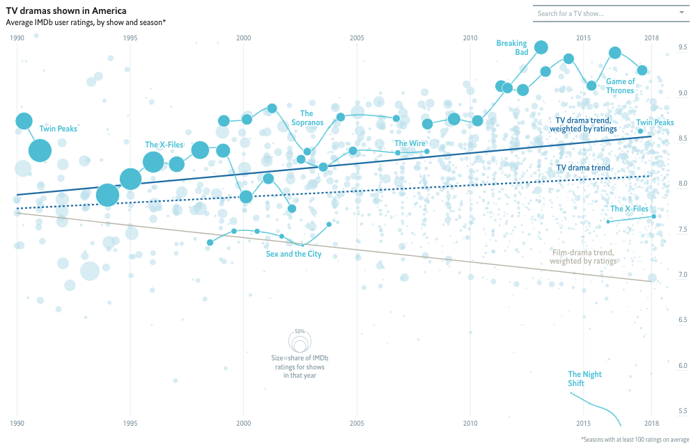
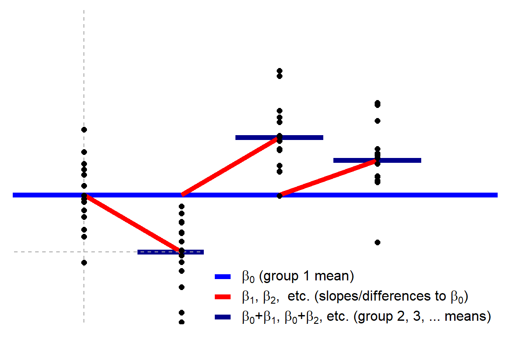

```{r setup, include = FALSE}
library(learnr)
library(tidyverse)
#library(modelr)
library(lubridate) # to make it easy to work with dates

knitr::opts_chunk$set(echo = FALSE)

url <- "https://raw.githubusercontent.com/TheEconomist/graphic-detail-data/master/data/2018-11-24_tv-ratings/IMDb_Economist_tv_ratings.csv"

tv_data <- read_csv(url)

tv_data_edit <- tv_data %>% 
  mutate(decade = lubridate::floor_date(ymd(date), years(10))) %>% 
  mutate(decade = as.character(format(decade,"%Y"))) %>% 
  mutate(scifi = ifelse(grepl("Sci-Fi", genres), "scifi", "no")) %>% 
  group_by(decade) %>% 
  mutate(mean = mean(av_rating))

# replace include=FALSE with include=TRUE (note lack of spaces) to create the version that has the answers in it
```

## Instructions

To participate in this activity you will need have to two windows readily available to you:

1) Your Zoom window  
2) The Team Up! activity linked from Quercus in a browser window for voting.

I would recommend that one member of the team shares their screen with the rest of the team and shows this activity where you can see the question and options.

Note 1: In the Team Up! activity you will just see the letters for the questions, not the options themselves. 

Note 2: There are hints for some questions, but if you get really stuck, please use the 'Ask for Help' option in Zoom. 


Question 1 to 7 refer to the TV show data discussed. 

## The data

### Golden age of TV?
Let's look at some data from a [2018 article in the Economist](https://www.economist.com/graphic-detail/2018/11/24/tvs-golden-age-is-real).

```{r, echo=FALSE, fig.align='center', out.width="65%"}

```

```{r, echo = TRUE, eval=FALSE}
# Libraries
library(tidyverse)
library(modelr)
library(lubridate) # to make it easy to work with dates

url <- "https://raw.githubusercontent.com/TheEconomist/graphic-detail-data/master/data/2018-11-24_tv-ratings/IMDb_Economist_tv_ratings.csv"

tv_data <- read_csv(url)

head(tv_data, n = 10)

glimpse(tv_data)
```

Each row (i.e., observation) is an episode of TV show.

Suppose we are interested in investigating `decade` (decade that the TV show was released) and `rating` the `av_rating` (average rating per episode).

```{r, include = TRUE, eval=FALSE}
# Fix up the data a bit (we'll talk about data wrangling)
tv_data_edit <- tv_data %>% 
  mutate(decade = lubridate::floor_date(ymd(date), years(10))) %>% 
  mutate(decade = as.character(format(decade,"%Y"))) %>% 
  group_by(decade)
```

## Question 1 

### Assumptions

Carefeully consider the `head` and `glimpse` of the data provided in the data section and the plot below.

```{r, scatterplot}
tv_data_edit %>% 
  ggplot(aes(x = date, y = av_rating)) +
  geom_point(alpha = 0.5) +
  theme_minimal() +
  geom_smooth(method = "lm", formula = "y~x") +
  labs(title = "Average rating of TV episodes by date aired", subtitle = "Line of best fit shown in blue", y = "Average rating of episode", x= "Date", caption = "Source: The Economist")

```

Suppose you wish to use fit a model to predict average episode rating (`av_rating`) from `date` alone. Using just the information you ahve so far, which ONE of the following comments is most appropriate?

**
A. Linear regression seems appropriate.  
B. Linear regression does not seem appropriate due to the independence assumption being violated.  
C. Linear regression does not seem appropriate due to the equality of variance assumption being violated.  
D. Linear regression does not seem appropriate due to the linearity assumption being violated.
**

Note: In the following questions we will assume we can proceed with linear regression. This may or may not be _correct_. I.e. it is not a hint to the answer to this question.

```{r assumptions, include=FALSE}
question("What is the correct answer?",
         answer("A"),
         answer("B", correct = TRUE),
         answer("C"),
         answer("D")
)
```


## Question 2

### t-test

Suppose you talk to a TV critic and they suggest that in industry there is a common belief that the average 'average' rating for TV shows in the 2010s was 8.1. (Note the careful language, we are working with data aggregated at the episode level.)

Restrict the data to just the episode from 2010. (If you don't know how to do this, there is a hint). Run a one sample t-test to test the claim from the TV critic. 

```{r onetest, exercise = TRUE}

```

```{r ontest-hint-1}
# You can get just the 2010 data with this code
just2010 <- filter(tv_data_edit, decade == "2010")
```

```{r ontest-hint-2}
# What is your null hypothesis here? Rember that you use mu = hypothesised value (insert valeu) to represent your hypothesised value
```

```{r include = FALSE, eval = FALSE}
just2010 <- filter(tv_data_edit, decade == "2010")
t.test(tv_data_edit$av_rating, mu = 8.1)
```

Which of the following is the best conclusion based on the result of your t-test?

**
A. We have no evidence against the claim that the average, average rating is 8.1.  
B. We have some evidence against the claim that that the average, average rating is 8.1.  
C. We have very strong evidence against the claim that the average, average rating is 8.1.  
D. The `t.test` functions produces an error due to a violation of Normality assumption.
**

```{r onetest_ans, include=FALSE}
question("What is the correct answer?",
         answer("A"),
         answer("B",),
         answer("C",  correct = TRUE),
         answer("D")
)
```


## Question 3

### Toy data

Let's take a moment to do something very simple. I have pulled five observations from each decade to plot.

```{r simpleplot, out.width=600}
set.seed(13)

# A very simple example
simple <- tv_data_edit %>% 
  sample_n(5) %>% 
  mutate(mean = mean(av_rating))

p <- simple %>% 
  ggplot(aes(x = decade, y = av_rating)) +
  geom_point() +
  theme_minimal()
p
```

### How do we make sense of this with linear regression?

Let's start by fitting a line to each group seperately. (Aside: if you interpretted each of these as a one sample t-test, you'd be testing $H_0: \mu 

```{r}

sep_mod <- c(
  lm(av_rating~1, filter(simple, decade == 1990))$coef,
  lm(av_rating~1, filter(simple, decade == 2000))$coef,
  lm(av_rating~1, filter(simple, decade == 2010))$coef
  )

names(sep_mod) <- c("xbar1990", "xbar2000", "xbar2010")

sep_mod

```

Hopefully you agree that the intercept of each of these 'intercept only' models are the means of each group.

```{r, echo=FALSE}
simple %>% 
  select(decade, mean) %>% 
  distinct() %>% 
  head()

p +
  geom_errorbar(aes(ymin = mean, ymax = mean), colour = "#612464") +
  geom_text(aes(label=round(mean,2), y = mean), nudge_x = 0.3, nudge_y = 0.05)

```

Now suppose I claim that we can desribe all 15 points with this equation:

$$y_i = d_{1}\bar{x}_{1990} + d_{2}\bar{x}_{2000} + d_{3}\bar{x}_{2010} + \epsilon_i$$

Where $\epsilon_i \sim \text{N}(0, \sigma)$.

Which ONE of the following would have to be true for this to be true?

**
A. $d_1$ would be a column of FIFTEEN 1s and then $d_2$ and $d_3$ would be columns of 0s and 1s, and take th value 1 when the observation is from 2000 and 2010 respectively.  
B. There are infinite possible combinations of three $d$ vectors for which this would be true, so as long as it is any one of those, this will be true.  
C. Each $d$ would have to be a vector of FIVE 0s and 1s, and take the value 1 when the observation is the decade indicaated by the $\mu_{year}$ it is multiplied by.  
D. Each $d$ would have to be a vector of FIFTEEN 0s and 1s, and take the value 1 when the observation is that decade.
**

```{r whatd, include=FALSE}
question("What is the correct answer?",
         answer("A"),
         answer("B"),
         answer("C"),
         answer("D", correct = TRUE)
)
```


## Question 4

Which ONE of these equations is equivalent to $y_i = d_{1}\bar{x}_{1990} +d_{2}\bar{x}_{2000} + d_{3}\bar{x}_{2010} +\epsilon_i$?

A. $y_i = \bar{x}_{1990} + d_{2}(\bar{x}_{2000}-\bar{x}_{1990}) + d_{3}(\ \bar{x}_{2010}-\bar{x}_{1990}) +\epsilon_i$
B. $y_i = \bar{x}_{1990} + d_{2000}(\bar{x}_{2000}-\bar{x}_{1990}-\bar{x}_{2010}) + d_{2010}(\bar{x}_{2010}-\bar{x}_{1990}-\bar{x}_{2000})+\epsilon_i$
C. $y_i = (\bar{x}_{1990} +\bar{x}_{2000} + \bar{x}_{2010})*(-d_{1} - d_{2} - d_{3})$
D. $y_i =d_{1}(\bar{x}_{1990}- \bar{x}_{2010}) + d_{2}( \bar{x}_{2000}- \bar{x}_{1990}) + d_{3}( \bar{x}_{2010}- \bar{x}_{1990}) +\epsilon_i$"

```{r dummies, include=FALSE}
question("What is the correct answer?",
         answer("A", correct = TRUE),
         answer("B"),
         answer("C"),
         answer("D")
)
```

```{r out.width=500}

# Add mean of group one, blue line 
p +
  geom_hline(yintercept = lm(av_rating~1, filter(simple, decade == 1990))$coef, color = "blue") +
# Add means of other groups in black  
  geom_segment(x = 1.7, xend = 2.3, y = sep_mod[2], yend = sep_mod[2]) +
  geom_segment(x = 2.7, xend = 3.3, y = sep_mod[3], yend = sep_mod[3]) +
# Beta 1 and Beta 2 are slopes of these red lines
  geom_segment(x = 2, xend = 2, y = sep_mod[1], yend = sep_mod[2], col = "red") +
  geom_segment(x = 3, xend = 3, y = sep_mod[1], yend = sep_mod[3], col = "red") +
  geom_text(aes(label=round(mean,3), y = mean), nudge_x = 0.3, nudge_y = 0.05)
```


A. 

### Interpretting a linear model

```{r interpret, exercise=TRUE}

```


```{r}
tv_data_edit %>% 
  ggplot(aes(x = decade, y = av_rating)) +
  geom_jitter(alpha = 0.3) +
  geom_boxplot(alpha = 0.5) +
  theme_minimal() +
  labs(title = "Box and dot plots of average episode rating by decade",
       y = "Average rating of episode", x = "Decade", caption = "Source: The Economist")
```


```{r, include = TRUE}
# Run an ANOVA
anova1 <- aov(av_rating~decade, data=tv_data_edit)

# Run a linear model
lm1 <- lm(av_rating~decade, data=tv_data_edit)
```

## Question 5

### ANOVA assumption rule of thumb

**Note**: there are specific tests for equality of variances, but for the purposes of this course we will just consider a rule of thumb from Dean and Voss (*Design and Analysis of Experiments*, 1999, page 112): if the ratio of the largest within-in group variance estimate to the smallest within-group variance estimate does not exceed 3,  $s^2_{max}/s^2_{min}<3$ , the assumption is probably satisfied. 

The below code produces a summary of the `tv_data_edit` tibble. You can ignore the '.groups = "keep"' part. Even if you are unfamiliar with the over syntax, you should be able to figure out what a, b, c, d and e are from your previous knowledge of R. 

```{r}
tv_data_edit %>% 
  group_by(decade) %>% 
  summarise(a = mean(av_rating), b = var(av_rating), c = sd(av_rating), d = var(av_rating)^2, e = max(av_rating), .groups = "keep")
```

```{r eqvar, excercise = TRUE}
# You can use this area as a calculator

```

Which of the following is true based on this table

**
A. The equality of variances assumption appears to be satisfied, therefore ANOVA is definitely appropriate.   
B. The equality of variances assumption appears to be satisfied, but we can't proceed with ANOVA without checking the other assumptions.  
C.  The equality of variances assumption appears to be seriously violated, therefore ANOVA is not.
D. Not enough information to make a claim about the equality of variances assumption.


## Question 6

### One-way ANOVA as regression

Model: One mean for each group predicts $y$.

$$y = \beta_0 + \beta_1x_1 + \beta_2x_2 + \beta_3x_3+\ldots\ H_0:\beta_0=y$$

where $x_i$ are indicators ($x=0$ or $x=1$) where at most one $x_i=1$ while all others are $x_i=0$.

Notice how this is just ''more of the same" of what we saw with the t-test. When there are only two groups, this model is $y=\beta_9 + \beta_1x_1$, the independent t-test. If there is only one group? $y=\beta_0$, the one-sample t-test. I hope this is easier to see from the visualization. 


```{r, echo=FALSE, fig.align='center', out.width="100%"}

```


## Question 8

Which ONE of these models is NOT linear?

A. $Y = \beta_0 + \beta_1X_1 + \beta_2X_3^2$  
B. $Y = \beta_0 + \beta_1X_1 + \beta_2X_2X_3$  
C. $Y = \beta_0 + \beta_1X_1 + X_3^{\beta_2}$  
D. $Y = \beta_0 + \beta_1X_1 + \beta_2X_2 + \beta_3cos(X_3)$  

```{r linear, include=FALSE}
question("What is the correct answer?",
         answer("A"),
         answer("B"),
         answer("C", correct = TRUE),
         answer("D"))
```

## Question 9

LaTeX is a document preparation system that allows us to type set mathematic symbols well. In R Markdown, which we will use for assessments in this course (more on that next week for those who are unfamiliar), we can use LaTeX syntax to write equations and mathematical symbols. Single dollar sign pairs \$ create inline expressions and double dollar sign pairs (\$\$) will show the express in dispaly mode.

Inline: $\pi^2$

Display: $$\pi^2$$

- Greek letters can be diplayed with a back slash before their name, e.g., `$\eta$` -> $\eta$.
- Superscripts: `$a^b$` -> $a^b$, or `$a^{2b}$` -> $a^{2b}$.
- Subscripts: `$a_b$` -> $a_b$, or `$a_{2b}$` -> $a_{2b}$.

Which of the following lines of LaTeX would create the equation below (if correctly put in dollar signs \$)? 

$$y_i = \beta_0 + \beta_1x_{1i} + \epsilon_i$$

A. `yi = \beta0 + \beta1x{1i} + \epsilon i`  
B. `y_i = \beta_0 + \beta_1x_1i + \epsilon_i`  
C. `y_i = \b_0 + \b_0\ex_1i + \error_i`  
D. `y_i = \beta_0 + \beta_1x_{1i} + \epsilon_i`  

```{r latex, include=FALSE}
question("What is the correct answer?",
         answer("A"),
         answer("B"),
         answer("C"),
         answer("D", correct = TRUE)
)
```

## Question 10

One of the important administrative [Forms](https://q.utoronto.ca/courses/204826/pages/forms) for this course has an emoji hiding in it. Check each of the forms and select which ONE of the following emoji it is.

A. 🚯   
B. 🔤  
C. 🚝  
D. 🕧  

Note: These are all examples of unpopular (i.e. not commonly used) emoji based on http://emojitracker.com/. Photosensitivity warning for flashing as the site updates realtime.

```{r formemoji, include=FALSE}
question("What is the correct answer?",
         answer("A"),
         answer("B", correct = TRUE),
         answer("C"),
         answer("D")
)
```


