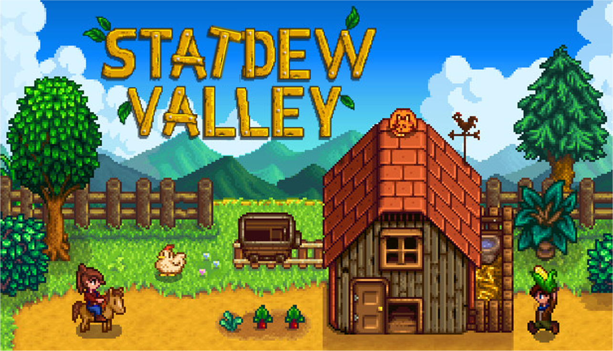

```{r setup, include = FALSE}
# These are the packages you will need for this activity
packages_needed <- c("tidyverse", "learnr")

package.check <- lapply(
  packages_needed,
  FUN = function(x) {
    if (!require(x, character.only = TRUE)) {
      install.packages(x, dependencies = TRUE, repos = "http://cran.us.r-project.org")
    }
  }
)

# Credit: package.check based on a helpful post from Vikram Baliga https://vbaliga.github.io/verify-that-r-packages-are-installed-and-loaded/

library(learnr)
library(tidyverse)
library(lme4)

knitr::opts_chunk$set(echo = FALSE)

strawberry <- tibble(patch = rep(LETTERS[1:18], each = 6),
  treatment = rep(rep(c("No netting", "Netting", "Scarecrow"), each = 2), times=18),
  yield = c(837.4, 840.77, 853.29, 836.56, 611.72, 519.19, 888.89, 953.07, 947.76, 957.13, 627.6, 505.81, 659.95, 692.02, 589.16, 658.43, 523.59, 401.15, 445.43, 535.07, 902.05, 903.2, 892.48, 896.87, 927.16, 961.84, 992.97, 885.17, 498.57, 443.55, 524.05, 563, 434.05, 337.48, 631.33, 641.19, 804.36, 867.16, 828.58, 864.59, 591.92, 522.06, 709.58, 901.48, 928.56, 908.38, 739.81, 534.37, 699.31, 752.1, 712.14, 662.61, 575.66, 475.59, 903.78, 907.68, 926.77, 913.07, 624.31, 542.83, 711.95, 986.7, 843.28, 680.08, 640.26, 326.88, 626.73, 574.56, 429.59, 394.77, 464.36, 626.33, 891.77, 875.99, 873.64, 834.44, 599.71, 528.52, 894.39, 839, 887.76, 984.05, 530.42, 530.61, 752.49, 689.06, 729.33, 690.72, 596.13, 438.45, 899.69, 917.25, 889.67, 904.06, 628.39, 537.69, 1227.03, 987.17, 801.67, 600.89, 462.74, 510.97, 581.79, 672.63, 453.58, 256.99, 727.98, 566.31))
```

```{r, echo=FALSE, fig.align='center', out.width="100%"}

```

## Instructions

This is a revision task based on the Week 4 Team Up! activity. There are no bonus points for completing the task asynchronously, but I hope it might be a useful revision tool for you.

There are hints for some questions. In these cases the final hint is complete correct code.

You can clear your answers and start again with the 'Start Over' button at the bottom of the menu. (I doubt this is well optimized for mobile, so if you can't see it, use a larger screen.)

## Data

```{r, echo=FALSE, fig.align='center', out.width="90%"}

```

You have also have some data about strawberry yields (in kgs) across 18 different strawberry patches on your farm. There had been a problem with birds eating more than their fair share of your grandmother's strawberries (there wouldn't be enough for her famous jam!) so she had tried out three 'treatment' types: a scarecrow, covering the strawberries with netting and doing nothing (as a control).

Each patch was harvested 6 times, twice under each treatment. Your grandmother says weather and soil conditions were remarkably consistent across the entire time.

The chunk below sets up the data (I am hoping this will help with the issues some have had with the interactive). Make sure you run it and take a look at the data.

```{r data, exercise = TRUE}
library(tidyverse)
strawberry <- tibble(patch = rep(LETTERS[1:18], each = 6),
  treatment = rep(rep(c("Scarecrow", "Netting", "No netting"), each = 2), times=18),
  yield = c(837.4, 840.77, 853.29, 836.56, 611.72, 519.19, 888.89, 953.07, 947.76, 957.13, 627.6, 505.81, 659.95, 692.02, 589.16, 658.43, 523.59, 401.15, 445.43, 535.07, 902.05, 903.2, 892.48, 896.87, 927.16, 961.84, 992.97, 885.17, 498.57, 443.55, 524.05, 563, 434.05, 337.48, 631.33, 641.19, 804.36, 867.16, 828.58, 864.59, 591.92, 522.06, 709.58, 901.48, 928.56, 908.38, 739.81, 534.37, 699.31, 752.1, 712.14, 662.61, 575.66, 475.59, 903.78, 907.68, 926.77, 913.07, 624.31, 542.83, 711.95, 986.7, 843.28, 680.08, 640.26, 326.88, 626.73, 574.56, 429.59, 394.77, 464.36, 626.33, 891.77, 875.99, 873.64, 834.44, 599.71, 528.52, 894.39, 839, 887.76, 984.05, 530.42, 530.61, 752.49, 689.06, 729.33, 690.72, 596.13, 438.45, 899.69, 917.25, 889.67, 904.06, 628.39, 537.69, 1227.03, 987.17, 801.67, 600.89, 462.74, 510.97, 581.79, 672.63, 453.58, 256.99, 727.98, 566.31))

glimpse(strawberry)
```

## Question 1

To answer the following question, wrangle and plot the strawberry data as follows:

1. Change the order of the levels of the treatment factor so that instead of being alphabetical, they go: "No netting", "Netting", "Scarecrow". (I.e. the legend should be in that order, with "No netting" at the top.)
1. Pipe this changed strawberry data directly into a ggplot.
1. Put `patch` on your x-axis, `yield` on your y, and colour by `treatment`.
1. Use points as your geometry. (There is probably a bit of overprinting, but we won't owrry about that here.)
1. You can add `theme_minimal()` if you like, but use the default colour palette.

```{r plot, exercise = TRUE, exercise.setup = "data"}

```

```{r plot-hint-1}
### add this to your code if the data isn't loading for you or it says it doesn't know what %>% is
library(tidyverse)
strawberry <- tibble(patch = rep(LETTERS[1:18], each = 6),
  treatment = rep(rep(c("Scarecrow", "Netting", "No netting"), each = 2), times=18),
  yield = c(837.4, 840.77, 853.29, 836.56, 611.72, 519.19, 888.89, 953.07, 947.76, 957.13, 627.6, 505.81, 659.95, 692.02, 589.16, 658.43, 523.59, 401.15, 445.43, 535.07, 902.05, 903.2, 892.48, 896.87, 927.16, 961.84, 992.97, 885.17, 498.57, 443.55, 524.05, 563, 434.05, 337.48, 631.33, 641.19, 804.36, 867.16, 828.58, 864.59, 591.92, 522.06, 709.58, 901.48, 928.56, 908.38, 739.81, 534.37, 699.31, 752.1, 712.14, 662.61, 575.66, 475.59, 903.78, 907.68, 926.77, 913.07, 624.31, 542.83, 711.95, 986.7, 843.28, 680.08, 640.26, 326.88, 626.73, 574.56, 429.59, 394.77, 464.36, 626.33, 891.77, 875.99, 873.64, 834.44, 599.71, 528.52, 894.39, 839, 887.76, 984.05, 530.42, 530.61, 752.49, 689.06, 729.33, 690.72, 596.13, 438.45, 899.69, 917.25, 889.67, 904.06, 628.39, 537.69, 1227.03, 987.17, 801.67, 600.89, 462.74, 510.97, 581.79, 672.63, 453.58, 256.99, 727.98, 566.31))
```

```{r plot-hint-2}
# fct_relevel() can help you change the order of the levels of a factor. There is an example for the honey data in the main Statdew valley interactive.
```

```{r plot-hint-3}
# Inside your ggplot() command, your aesthetic should look like this: aes(x = patch, y = yield, colour = treatment)
```

```{r plot-solution, echo=FALSE, eval = FALSE}
strawberry %>% 
  mutate(treatment = fct_relevel(treatment, "No netting", after = 0)) %>% 
  ggplot(aes(x = patch, y = yield, colour = treatment)) +
  geom_point() +
  theme_minimal()
```

**Which patch and treatment combo had the lowest yield __green__ dot on your graph?**

**
A. Patch F, no netting.  
B. Patch D, scarecrow.  
C. Patch K, no netting.  
D. Patch R, netting.  
**

```{r q1, include=TRUE}
question("What is the correct answer?",
         answer("A"),
         answer("B"),
         answer("C"),
         answer("D", correct = TRUE),
         message = "See the final hint for the full code to generate the graph."
)
```


## Question 2

Considering the strawberry data described in the Data section and the plot you made, which ONE of the following statements best describes an appropriate analysis for this data?

**
A. We can approach this analysis with linear regression (all fixed effects) as all our assumptions appear to be valid.  
B. We should make patch a fixed effect and treatment a random effect.  
C. We should make patch a random effect and treatment a fixed effect and include a patch-treatment interaction (also a random effect).  
D. We should make everything a random effect.
**

```{r q2, include=TRUE}
question("What is the correct answer?",
         answer("A"),
         answer("B"),
         answer("C", correct = TRUE),
         answer("D"),
         message = "We want to interpret treatment, so it should be a fixed effect. We expect stawberries from the same patch to potentially be more similar to each other than strawberries across patches, i.e., correlated. We don't want to interpret patch effects, and it won't help us make predictions for new patches, but we shouldn't ignore the fact that it violates our assumptions of linear regression. Thus, we'll make patch a random effect. As each patch also undergoes each treatment, we're interested in accounting for interactions between patch and treatment as well."
)
```

## Question 3

The below code aggreagtes the data to get the average yield by treatment and patch.

```{r agg, exercise = TRUE, exercise.setup = "data"}
strawberry_agg <- strawberry %>% 
  group_by(patch, treatment) %>% 
  summarize(yield_avg = mean(yield), .groups = "drop")
strawberry_agg
```

**How many values are averaged to get each observation of `yield_avg` in `strawberry_agg`?**

**
A. 2  
B. 3  
C. 6  
D. 18
**

```{r q3, include=TRUE}
question("What is the correct answer?",
         answer("A", correct = TRUE),
         answer("B"),
         answer("C"),
         answer("D"),
         message = "Two, because there are two observations of each treatment on each patch."
)
```

## Question 4

Suppose an appropriate model for this data is:
$$y_{ijk} = \mu + \alpha_i + b_j + (\alpha b)_{ij} + \epsilon_{ijk}$$

where: 

* $\mu$ is the grand mean yield of strawberries, in kgs, across all the data.  
* $\alpha_i$ is the fixed effect of treatment.  
* $b_j$ is the random effect of patch.  
* $\epsilon_{ijk}$ is the error term.  

Which ONE of the following statements is FALSE?

**
A. $\alpha_i$ and $(\alpha b)_{ij}$ are the only fixed effects in this model.  
B. $\mu$ is the same for all values of i, j and k.  
C. There are three random quantities being estimated.  
D. $b_j \sim N(0, \sigma_b^2)$ in this model.
**

```{r q4, include=TRUE}
question("What is the correct answer?",
         answer("A", correct = TRUE),
         answer("B"),
         answer("C"),
         answer("D"),
         message = "The interaction of a fixed effect and a random effect is ALSO a random effect, so A is not completely true."
)
```

## Question 5

```{r models, exercise = TRUE, exercise.setup = "data", exercise.lines = 35}
# Fit a model with yield as the response and the main effects 
# and interaction of treatment and patch as the explanatory variables
strawberry_int <- lm(__________, data = strawberry)

# This is the code from the previous questions that aggreagtes 
# the data to get the average yield by treatment and patch.
strawberry_agg <- strawberry %>% 
  group_by(patch, treatment) %>% 
  summarize(yield_avg = mean(yield), .groups = "drop")
strawberry_agg

# Fit a linear model model using the strawberry_agg data that has 
# yield_avg as the response and treatment and patch as main effects. 
# No interaction.
strawberry_agg_mod <- lm(__________, data = strawberry)

# This code aggreagtes the data to find the average yield for each patch
strawberry_agg2 <- strawberry %>% 
  group_by(patch) %>% 
  summarize(yield_avg = mean(yield), .groups = "drop")

# Fit a INTERCEPT ONLY linear model using the strawberry_agg2 data
# that has yield_avg as the reponse.
strawberry_patch_mod <- lm(__________, data = strawberry)


# One you have added the models above, you will need to figure out 
# what each of these terms are.

# A
summary(strawberry_agg_mod)$sigma^2 - (summary(strawberry_int)$sigma^2)/2

# B
summary(strawberry_patch_mod)$sigma^2 - (summary(strawberry_agg_mod)$sigma^2)/3

# C
summary(strawberry_int)$sigma^2

# We will continue to dicuss fixed and random effects and linear models next week. 
# Here is a sneak peek of the way we would fit this kind of model porfessionally. 
# It may or may not give you some hints for this question if you can 
# figure out the output and match it with the above.
mod <- lme4::lmer(yield ~ treatment + (1|patch) + (1|patch:treatment), data = strawberry)
summary(mod)

```

```{r, models-hint-1}
## add the data to the top of your code if it isn't loading
strawberry <- tibble(patch = rep(LETTERS[1:18], each = 6),
  treatment = rep(rep(c("Scarecrow", "Netting", "No netting"), each = 2), times=18),
  yield = c(837.4, 840.77, 853.29, 836.56, 611.72, 519.19, 888.89, 953.07, 947.76, 957.13, 627.6, 505.81, 659.95, 692.02, 589.16, 658.43, 523.59, 401.15, 445.43, 535.07, 902.05, 903.2, 892.48, 896.87, 927.16, 961.84, 992.97, 885.17, 498.57, 443.55, 524.05, 563, 434.05, 337.48, 631.33, 641.19, 804.36, 867.16, 828.58, 864.59, 591.92, 522.06, 709.58, 901.48, 928.56, 908.38, 739.81, 534.37, 699.31, 752.1, 712.14, 662.61, 575.66, 475.59, 903.78, 907.68, 926.77, 913.07, 624.31, 542.83, 711.95, 986.7, 843.28, 680.08, 640.26, 326.88, 626.73, 574.56, 429.59, 394.77, 464.36, 626.33, 891.77, 875.99, 873.64, 834.44, 599.71, 528.52, 894.39, 839, 887.76, 984.05, 530.42, 530.61, 752.49, 689.06, 729.33, 690.72, 596.13, 438.45, 899.69, 917.25, 889.67, 904.06, 628.39, 537.69, 1227.03, 987.17, 801.67, 600.89, 462.74, 510.97, 581.79, 672.63, 453.58, 256.99, 727.98, 566.31))

strawberry_int <- lm(yield ~ treatment*patch, data = strawberry)
summary(strawberry_int)

strawberry_agg_mod <- lm(yield_avg ~ treatment + patch, data = strawberry_agg)
summary(strawberry_agg_mod)

strawberry_patch_mod <- lm(yield_avg ~ 1, data = strawberry_agg2)
summary(strawberry_patch_mod)

# A
summary(strawberry_agg_mod)$sigma^2 - (summary(strawberry_int)$sigma^2)/2

# B
summary(strawberry_patch_mod)$sigma^2 - (summary(strawberry_agg_mod)$sigma^2)/3

# C
summary(strawberry_int)$sigma^2
```

```{r, models-hint-2}
# I = 3 (treatments)
# J = 18 (patches)
# K = 2 (obs in each level of treatment/patch)
```

```{r, models-hint-3}
# sigma^2 is the variance of our error term. In this balanced design you can get it by squaring the residual standard error from the interaction (and main effects) model.
```

```{r, models-hint-4}
# The variability explained by the interaction term is equal to the variance of the main effects model on the aggreagted data (one average observation per treatment and patch) minus [the variance of the interaction (and main effects model) model divided by the number of observations per patch/treatment combo].

# The variability explained by patch to patch differences (separate to the interaction effect) is the patch-to-patch variability (intercept only model on the aggregated data by patch) minus [the variance of the main effects model on the aggreagted data (one average observation per treatment and patch) divided by the number of treatments]

```

```{r, models-solution}
strawberry_int <- lm(yield ~ treatment*patch, data = strawberry)
summary(strawberry_int)

strawberry_agg_mod <- lm(yield_avg ~ treatment + patch, data = strawberry_agg)
summary(strawberry_agg_mod)

anova(strawberry_agg_mod)

strawberry_agg2 <- strawberry %>% 
  group_by(patch) %>% 
  summarize(yield_avg = mean(yield), .groups = "drop")

strawberry_patch_mod <- lm(yield_avg ~ 1, data = strawberry_agg2)
summary(strawberry_patch_mod)

# I = 3 (treatments)
# J = 18 (patches)
# K = 2 (obs of treatment/patch)

(summary(strawberry_int)$sigma^2)
(summary(strawberry_agg_mod)$sigma^2 - (summary(strawberry_int)$sigma^2)/2)
(summary(strawberry_patch_mod)$sigma^2 - (summary(strawberry_agg_mod)$sigma^2)/3)

mod <- lme4::lmer(yield ~ treatment + (1|patch) + (1|patch:treatment), data = strawberry)
summary(mod)
```


**
A. A is $\hat{\sigma}^2$, B is $\hat{\sigma}_b^2$, C is $\hat{\sigma}_{\alpha b}^2$.  
B. A is $\hat{\sigma}_b^2$, B is $\hat{\sigma}^2$, C is $\hat{\sigma}_{\alpha b}^2$.  
C. A is $\hat{\sigma}_{\alpha b}^2$, B is $\hat{\sigma}_b^2$, C is $\hat{\sigma}^2$.  
D. A is $\hat{\sigma}_{\alpha b}^2$, B is __not__ actually one of the variances for our random effects, C is $\hat{\sigma}^2$.  
**

```{r q5, include=TRUE}
question("What is the correct answer?",
         answer("A"),
         answer("B"),
         answer("C", correct = TRUE),
         answer("D"),
         message = "See the hints for full discussion."
)
```


## Question 6

Suppose our data was presented as follows. We are still interested in making the same plot and doing the same models as before.
```{r echo = FALSE}
strawberry %>% 
  group_by(patch) %>% 
  mutate(observation = 1) %>% 
  mutate(observation = str_c(treatment, ", harvest  ", cumsum(observation))) %>% 
  select(-treatment) %>% 
  pivot_wider(names_from = observation, values_from = yield) %>% 
  knitr::kable()
```

**Which ONE of the following statements best describes our situation with this new version of the dataset?**

**
A. This dataset is also tidy for our purposes.  
B. This dataset is NOT tidy for our purposes because each observational unit has too many observations.  
C. This dataset is NOT tidy for our purposes because it is not the case that each value is in one and only one cell.  
D. This dataset is NOT tidy for our purposes because it is not the case that each variable is in one and only one column.  
**

```{r q6, include=TRUE}
question("What is the correct answer?",
         answer("A"),
         answer("B"),
         answer("C"),
         answer("D", correct = TRUE),
         message = "Treatment should be one column, not the levels of treatment split across several columns."
)
```

## Question 7

Recall the flow chart from Week 3.

```{r, echo=FALSE, fig.align='center', out.width="90%"}
knitr::include_graphics("images/w4/studies.png")
```

The difference between the types of cohort studies listed here is the timing of when the researcher gets involved. The difference between case control studies and cohort studies is which information participants are recruited on, that is what why *know* at the beginning vs what we find out. For cohort studies, we recruit on exposure. For case-control studies, we recruit on outcome status (shown as disease in the image below, but canbe more broad).

I like the visual below for explaining this also. (Don't worry about odds ratios (OR) and risk ratios (RR) until we cover logistic regression.)

Question marks identify what is _not_ known when recruitng participants. Circles (filled or not) represent what was known when recruiting participants.

```{r, echo=FALSE, fig.align='center', out.width="90%"}
knitr::include_graphics("images/w4/designs-wiki.png")
```

Image source: Jmarchn - File:ExplainingCaseControlSJW.jpg from Kelidimari, CC BY-SA 3.0, https://commons.wikimedia.org/w/index.php?curid=75663040


Suppose a study is being conducted in a small city about 45 minutes drive from your Statdew Valley farm. You read about it in the Statdew Valley Gazette. 

> ...As locals will remember, a somewhat suspiciously glowing cloud (dubbed the 'Glow Cloud' by then 4-year-old Susie Carlos) appeared over the West side of town 20 years ago for a period of 6 months. Local legend has emerged that children living in the area covered by the Glow Cloud became much better at doing their multiplication tables. Now a study is exploring this claim. 30 local children who were aged 5 to 7 and lived under the Glow Cloud and 30 local children, of the same age range, who didn't have been recruited for the study. Their scores on an end of year multiplcation facts test conducted by all local schools in Grade 7 will be accessed to investigate this firther...

**What kind of study is this?**

**
A) Randomised control trial.  
B) Prospective cohort.  
C) Retrospective cohort.  
D) Case-control.
**

```{r q7, include=TRUE}
question("What is the correct answer?",
         answer("A"),
         answer("B"),
         answer("C"),
         answer("D", correct = TRUE),
         message = "Retrospective cohort study because the investigators do not randomly assign subjects to treatments (so not RCT), participants are selected based on exposure status (not outcome, so not case control) and both the exposure (glow cloud or not) and the outcome (multiplcation facts test score) occured in the past, before the study started (not prospective)."
)
```
